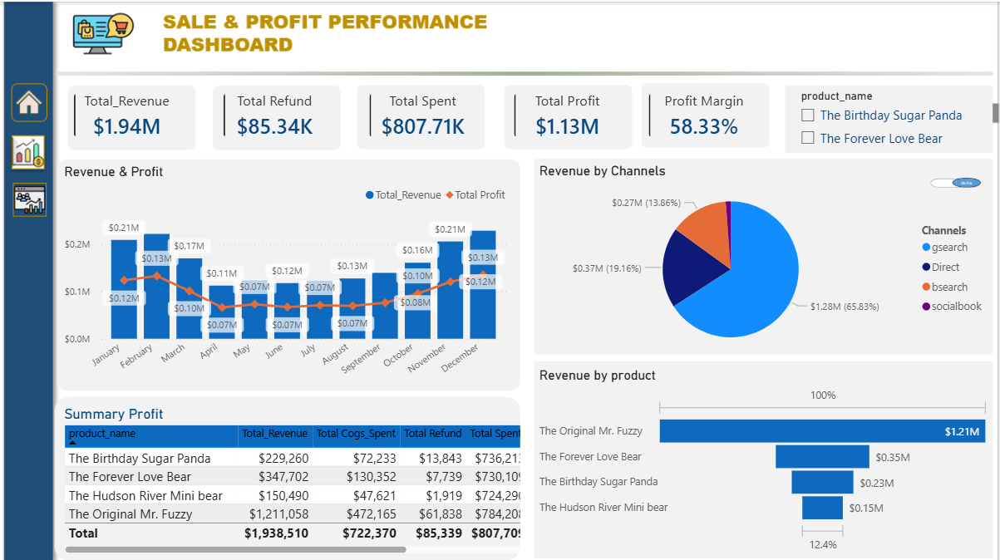
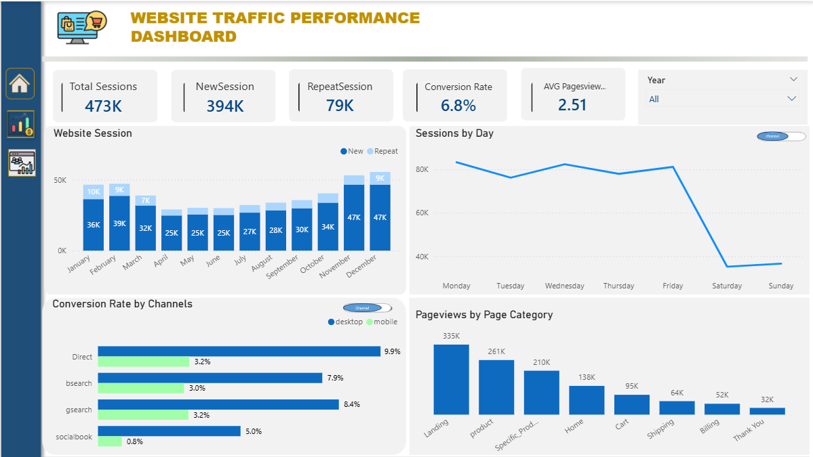

# 📊Ecommerce Analysis using Power BI
Welcome to the Ecommerce Online Store Analysis project!
This project focuses on analyzing e-commerce data to generate actionable insights using Power BI.

# 🚀Overview
This project provides a comprehensive analysis of an online store’s performance through two interactive dashboards:
- **📈 Sales & Profit Performance**
- **🌐 Website Traffic Analysis**
  
The goal is to support data-driven decision-making by uncovering trends in revenue, customer behavior, and website performance.

# ❓ Business Questions
1. How is the company performing financially over time based on revenue and profit trends?
2. Which marketing channels, devices, and products contribute most to revenue?
3. What are the trends in website traffic and user engagement, and how do they impact conversion and revenue?
   
# 📂 Dataset Description
**Source: Maven Analytics – Toy Store E-Commerce Dataset**

The dataset includes 6 main tables:
- Website Sessions: User interactions with the website by date and traffic source
- Website Pageviews: Pages viewed during each session
- Orders: Unique transaction records (one row per order)
- Order Items: Products included in each order
- Order Items Refunds: Refund records for returned products
- Products: Product details
# 🛠️ Tools & Technologies
- **SQL** – Data extraction and transformation
- **Power BI Desktop** – Dashboard development
- **DAX (Data Analysis Expressions)** – KPI calculations
- **Power Query (M Language)** – Data cleaning and preparation
- **Data Modeling** – Building relationships between tables
- **Data Visualization** – Interactive dashboards and charts
# 📈 Sales & Profit Dashboard
**🔑 Key Performance Indicators (KPIs)**
- **Total Revenue:** Total sales from completed orders
- **Total Refund:** Total refunded amount
- **Total Spent:** Revenue after deducting refunds
- **Total Profit:** Net profit calculation
- **Profit Margin:** Profit divided by total revenue
  
**📊 Visualizations**
- **Revenue & Profit Trends (Line Chart):** Analyze performance over time
- **Revenue by Channel & Device (Pie Chart):** Identify top-performing sources
- **Revenue by Product (Funnel Chart):** Product contribution analysis
- **Profit Summary Table:** Overall business performance metrics

# 🌐 Website Traffic Dashboard
**🔑 Key Performance Indicators (KPIs)**

- **Total Sessions:** Total number of website visits
- **New Sessions:** First-time visitors
- **Repeat Sessions:** Returning visitors
- **Conversion Rate:** Orders divided by sessions
- **Average Pageviews:** Engagement level per session

**📊 Visualizations**
- **Session Trends Over Time (Line Chart)** Tracks website traffic over time to evaluate overall business performance and seasonality patterns
- **Traffic by Day & Channel (Line + Donut Chart)** Tracks website traffic over time to evaluate overall business performance and seasonality patterns
- **Conversion Rate Analysis (Line & Bar Chart)** Identifies high-performing months, traffic sources, and devices in terms of conversion efficiency
- **Pageviews by Category: User interest and behavior insights** Analyzes how users interact with different page types to understand user interest and engagement behavior

# 🔍 Key Findings & Conclusion
### 📈 Dashboard Insights

 **Sales & Profit Analysis**

**Website Traffic Analysis**

 
- Peak conversion rate reached 7.6%, with desktop direct traffic achieving 9.9%
- Peak conversion rate reached 7.6%, with desktop direct traffic achieving 9.9%
- Significant funnel leakage: approximately 43K users drop off between cart and purchase
- Mobile conversion rate is significantly lower than desktop performance
- Noticeable seasonal slowdown during summer months
- Revenue is heavily concentrated in a small number of products
- 
# 💡 Business Insights & Recommendations
- **Stop the leak:** Reduce friction in the checkout process to recover up to $1M in lost revenue
- **Close the gap:** Improve mobile user experience to match desktop performance
- **Smooth seasonality:** Strengthen marketing campaigns during low-performing months
_ **Diversify revenue:** Promote underperforming products, not just best-sellers
- **Increase retention:** Convert one-time buyers into loyal repeat customers

# 🎯 Final Conclusion
Overall, the analysis highlights clear opportunities to increase revenue, improve customer experience, and drive sustainable growth. By addressing key friction points in the checkout process, optimizing mobile performance, and strengthening marketing during low-demand periods, the business can unlock significant untapped potential.

In addition, focusing on product diversification and customer retention strategies will not only boost short-term sales but also build long-term customer loyalty and stability.

In summary, a data-driven approach to improving conversion, engagement, and retention can transform current performance gaps into measurable business growth.

